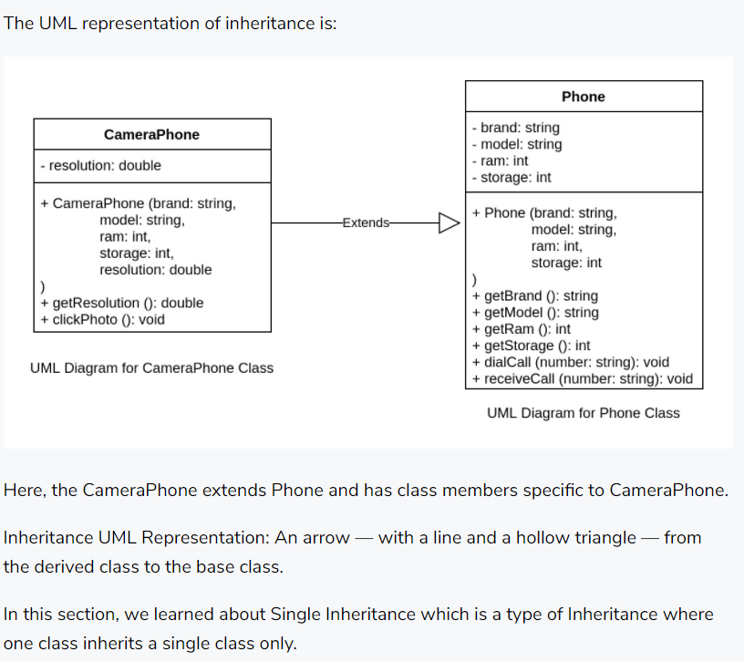
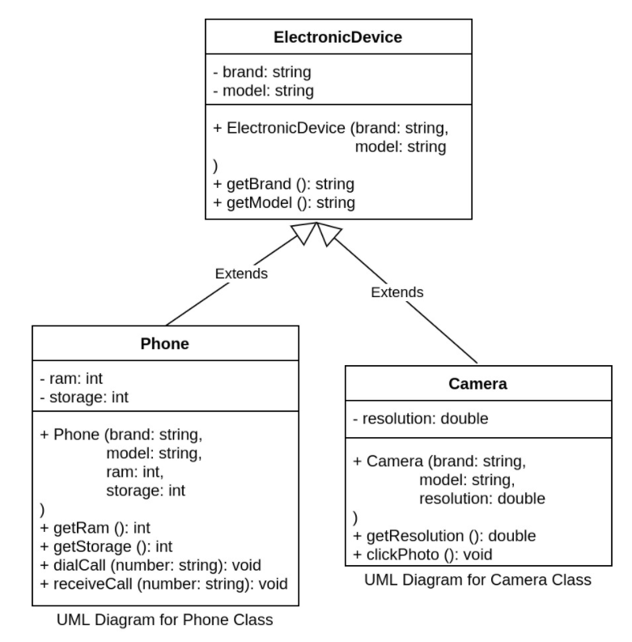
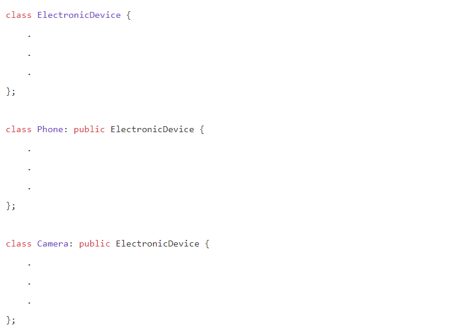
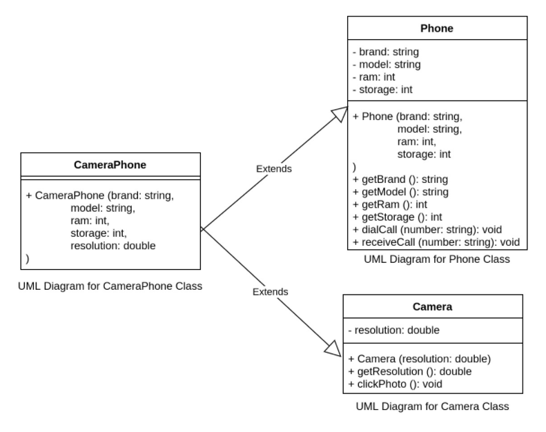
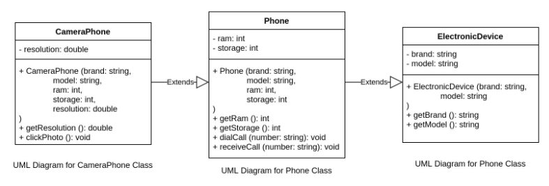

# Inheritance

1. Introduction:

    - There are multiple classes that a phone can belong to. We can define multiple classes based on an hierarchy. Let's look at a few dependencies based on hierarchy.

        - Every Human ```is-a``` Mammal
        - Every Mammal ```is-a``` Organism
        - Every Mammal ```is not a``` Human
        - Every Organism ```is not a``` Mammal
        - Every Phone ```is-a``` ElectronicDevice
        - Every CameraPhone ```is-a``` Phone
        - Every ElectronicDevice ```is not a``` Phone
        - Every Phone ```is not a``` CameraPhone

    - As we can see that any classification that is below in the hierarchy has an "is-a" relationship with its ancestor.

    - In this relationship, the ancestor is known as the base class and the descendant is known as the derived class. In case of Phone and CameraPhone (which is-a Phone), Phone is a base class and CameraPhone is the derived class.

    - If we were to create classes for both, we will see that all the attributes and functions provided by Phone will also be provided by CameraPhone.

    - Example

        - Phone will have brand, model, ram, storage

        - CameraPhone will also have brand, model, ram, storage

        - CameraPhone will have additional attributes and will provide additional functionalities on top of what the Phone class provides.

        - OOP languages allow us to reuse this and inherit attributes and functions from one class to another. This property is known as Inheritance.

        - Here, CameraPhone = Phone + extra attributes + extra functions

    - We can create the Phone and CameraPhone classes like this:

        ```c++
            class Phone {

                string brand;
                string model;
                int ram;
                int storage;

                public:
                    Phone (string brand, string model, int ram, int storage) {
                        this->brand = brand;
                        this->model = model;
                        this->ram = ram;
                        this->storage = storage;
                    }

                    string getBrand() {
                        return this->brand;
                    }

                    string getModel() {
                        return this->model;
                    }

                    int getRam() {
                        return this->ram;
                    }

                    int getStorage() {
                        return this->storage;
                    }
                    void dialCall (string number) {
                        cout << "Calling " << number << " from " << brand << ":" << model << "\n";
                    }
                    
                    void receiveCall (string number) {
                        cout << "Receiving call from " << number << " on " << brand << ":" << model << "\n";
                    }
            };

            class CameraPhone: public Phone {

                double resolution;

                public:
                    CameraPhone(string brand, string model, int ram, int storage, double resolution): Phone(brand, model, ram, storage) {
                        this->resolution = resolution;
                    }

                    double getResolution() {
                        return this->resolution;
                    }
                    
                    void clickPhoto () {
                        cout << "Clicking photo on a " << resolution << " MP " << getBrand() << ":" << getModel() << "\n";
                    }
            };
        ```

    - Here:

        - CameraPhone is derived from Phone class.
        - CameraPhone "extends" Phone class.
        - Extends relationship => ```class DerivedClass: public BaseClass```
        - Here, public is an inheritance-access-specifier. We will learn more about it later. For now, we will keep using public.
        - All the "public" class members of the base class is available in the derived class and its objects.
        - Examples:
        
            - We can call getBrand() inside clickPhoto().
            - We can call base class methods on the derived class object like this: cameraPhone.getBrand()
        
        - Private class members of the base class are not available in the derived class.
        - The constructor of the base class must be called first in the derived class constructor. We need to pass only the required parameters to the base class constructor.
        It is supposed to be done like this:
        
        ```c++
            DerivedClass (param1, param2, ...): BaseClass(param1, param2, ….) {
                /** derived class specific initialization **/
            }
        ```
    
    - This is also known as ```Single Inheritance``` which is a type of Inheritance where one class inherits a single class only.



2. Hierarchical Inheritance:

    - In Single Inheritance, we had one class inheriting from another class. Similarly, we have Hierarchical Inheritance in which multiple classes inherit a single base class.



    - There can be any number of derived classes and each derived class can have properties different from one another. The code for this will be exactly the same as Single Inheritance.



3. Multiple Inheritance:

    - We have seen the following relationship:

    - Every CameraPhone is-a Phone

    - While this is true, it should be noted that the following relationship is also true:
    - Every CameraPhone is-a Camera

    - Therefore, we can say that:
    - Every CameraPhone is-a Phone as well is-a Camera

    - This type of relationship where a class inherits multiple base classes is known as multiple inheritance. 
    
    - It can be represented as:



- The code would look something like this:

    - ```c++
            class Phone {
                .
                .
                .
            };

            class Camera {
                .
                .
                .
            };

            class CameraPhone: public Phone, public Camera {
                public:
                    CameraPhone(string brand, string model, int ram, int storage, double resolution): Phone(brand, model, ram, storage), Camera(resolution) {
                    }
            };

      ```
    
    - Here we mention the base classes as comma-separated-values with the inheritance-access-specifier. The constructors are also mentioned comma-separated with the required parameters.

    - In this particular example, CameraPhone does not have any property of its own and so we've not mentioned anything inside the constructor method. If there would have been a property in CameraPhone which was not inherited from its base classes, we can initialize it in the constructor just like we have been doing previously.

4. Mulitlevel Inheritance:

    - In Single Inheritance, there is a derived class which extends a base class whereas the base class is standalone and does not extend anything.
    Similar to Single Inheritance, we can have Multi-level Inheritance as well where the base class extends some other base class.

    - Example

        - Every Phone is-a ElectronicDevice
        - Every CameraPhone is-a Phone

    - This can be represented as:

        - Here Phone extends ElectronicDevice and CameraPhone extends Phone.

- 

    - The code would look something like this:

- 

